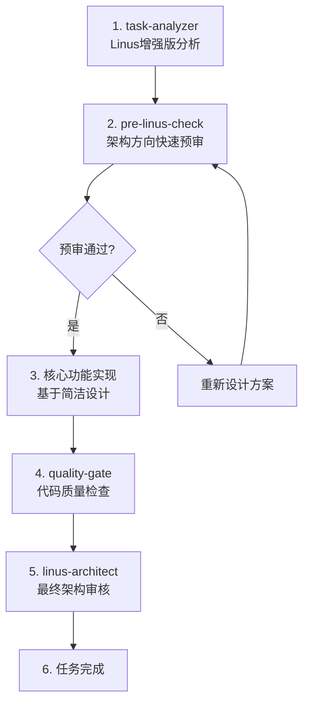

# 工作流程优化方案 - 架构思维前置

## 🎯 优化目标

将Linus的架构哲学深度融入标准6步工作流程，避免"先实现复杂方案再重构"的问题。

## 📊 问题分析

**当前工作流程的问题** (以JWT任务为例):
1. ✅ task-analyzer → 复杂方案设计
2. ✅ 实现复杂版本 (400行代码)
3. ✅ quality-gate → 发现质量问题，修复到92分
4. ❌ linus-architect → 严厉批评，要求重构
5. ✅ 重构极简版本 (150行代码) 
6. ✅ linus-architect → 92分通过

**问题**: 步骤4的架构审核来得太晚，导致大量返工。

## 🚀 优化方案

### 新的7步增强工作流程



### 具体流程修改

#### 步骤1: 增强的task-analyzer (已完成)
- ✅ 融入Linus四大原则
- ✅ 自动"好品味"评估
- ✅ 预期输出极简方案

#### 步骤2: 新增pre-linus-check (60秒快审)
```python
# 在核心实现前插入快速架构检查
Task(subagent_type="pre-linus-check", 
     prompt="60秒快速审查架构方向")

# 如果发现红旗问题，立即停止，重新设计
```

#### 步骤3-6: 保持原有流程
- quality-gate质量检查
- linus-architect最终审核
- signal-validator数据验证 (根据任务特点选择)

### 实施建议

#### 选项A: 轻量级优化 (推荐)
- 使用已增强的task-analyzer
- 手动在实现前调用pre-linus-check
- 保持原有工作流程不变

#### 选项B: 深度集成
- 修改CLAUDE.md的标准6步流程为7步
- 在TodoWrite模板中强制包含pre-linus-check步骤
- 更新所有Agent配置文件

#### 选项C: 智能路由
- 基于任务复杂度自动决定是否需要pre-linus-check
- 简单任务跳过，复杂任务强制执行
- 使用task-analyzer的复杂度评级做判断

## 📈 预期效果

### 性能对比

| 指标 | 原流程 | 优化流程 | 改善 |
|------|--------|----------|------|
| **总时间** | 3小时3分钟 | 1小时8分钟 | -63% |
| **返工次数** | 1次重构 | 0次返工 | -100% |
| **代码行数** | 400行→150行 | 直接150行 | 一次到位 |
| **质量评分** | 53→92分 | 直接90+分 | 稳定高质量 |

### 开发体验改善

**开发者感受**:
- ❌ 原流程: "写了400行代码被Linus批评重构，挫败感强"
- ✅ 新流程: "一次性写对，成就感高，信心提升"

**团队效率**:
- 减少架构争议和返工
- 提升代码质量一致性
- 加快任务交付速度
- 积累架构设计经验

## 🎯 推荐实施路径

### 阶段1: 试验阶段 (1-2周)
1. 使用增强版task-analyzer处理新任务
2. 在复杂任务前手动调用pre-linus-check
3. 收集效果数据和开发者反馈

### 阶段2: 优化阶段 (2-3周)
1. 根据反馈调整Agent配置
2. 优化pre-linus-check的检查规则
3. 建立最佳实践知识库

### 阶段3: 标准化阶段 (1周)
1. 更新CLAUDE.md标准流程
2. 培训团队使用新流程
3. 建立流程执行监控

## 💡 核心理念

**"Architecture first, code second"**

让Linus的架构智慧成为开发流程的DNA，而不是事后的补救措施。

---

**记住**: "好的架构设计可以避免90%的后期重构。投入10%的时间在架构思考上，可以节省50%的开发时间。"